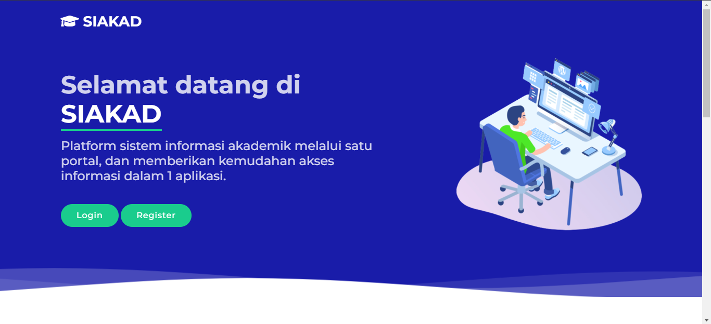
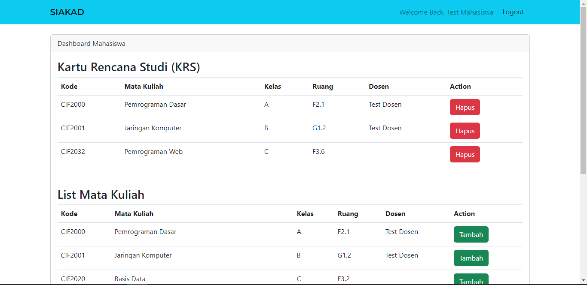

## SIAKAD (Sistem Informasi Akademik)

SIAKAD merupakan seubuah website yang bertujuan untuk menyediakan informasi dan manajemen akademik bagi sebuah institusi pendidikan (Sistem KRS). Repositori ini berisi kode sumber dan dokumentasi untuk website Sistem Informasi Akademik. 

## Fitur SIAKAD
- Regristrasi akun dengan role yang berbeda(admin, mahasiswa, dan dosen).
- Pengisian, pengeditan, dan penghapusan list mata kuliah yang bisa diambil.
- Pengambilan dan penghapusan "Dosen pengajar" pada mata kuliah oleh dosen pengampu terkait.
- pengambilan dan penghapusan mata kuliah pada KRS oleh mahasiswa terkait.

## Dokumentasi Website
### 1. Landing Page

### 2. Dashboard Page
